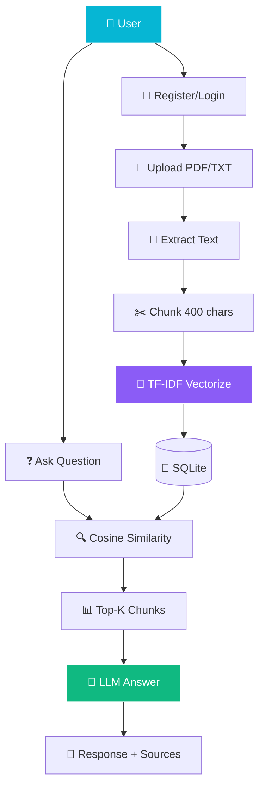

<!-- ═══════════════════════════════════════════════════════════════ -->
<!-- 💬 AI Document Chat — Chat Bubble Style README -->
<!-- ═══════════════════════════════════════════════════════════════ -->

<!-- ═══════ CHAT-STYLE HEADER ═══════ -->
<div align="center">
  
</div>

<!-- ═══════ CHAT BUBBLE MASCOTS ═══════ -->
<div align="center">
  
  
  
  
  
</div>

<br/>

<!-- ═══════ CHAT TYPING SVG ═══════ -->
<div align="center">
  
</div>

<br/>

<!-- ═══════ ACTUAL CHAT BUBBLES (UNIQUE!) ═══════ -->
<div align="center">

<table border="0" cellspacing="0" cellpadding="8" width="80%">
<tr>
<td align="right" width="100%">


</td>
</tr>
<tr>
<td align="left" width="100%">


<br/>
<br/>

<sub>
📎 <b>Sources:</b> 
<code>document.pdf</code> (0.84 relevance)
</sub>

</td>
</tr>
</table>

</div>

<br/>

<!-- ═══════ AI SCENES ═══════ -->
<div align="center">
  
  
  
</div>

<br/>

<!-- ═══════ LIVE BADGES ═══════ -->
<div align="center">
  <a href="https://github.com/sumit966/ai-document-chat/stargazers">
    
  </a>
  <a href="https://github.com/sumit966/ai-document-chat/network/members">
    
  </a>
  <a href="https://github.com/sumit966/ai-document-chat/issues">
    
  </a>
  <a href="https://github.com/sumit966/ai-document-chat/commits/main">
    
  </a>
</div>

<br/>

<div align="center">
  
  
  
  
  
  
</div>

<br/>

<div align="center">
  
  
  
  
</div>

<br/>

<div align="center">
  <i>💬 Full-Stack AI App · Author: <b>Sumit Raj</b> · M.Tech VNIT Nagpur · Ex-Salesforce</i>
</div>

<br/>


---

## 🎯 Overview


A **full-stack document chat application** with:

<table>
<tr>
<td width="25%" align="center">

### 1️⃣ Upload


PDF or text files

</td>
<td width="25%" align="center">

### 2️⃣ Ask


Natural language

</td>
<td width="25%" align="center">

### 3️⃣ Retrieve


Cosine similarity

</td>
<td width="25%" align="center">

### 4️⃣ Answer


From your docs only

</td>
</tr>
</table>

> **🎯 Purpose:** Get instant answers from large PDFs — without reading every page, and without cloud privacy concerns.

---

## ❌ Problem Statement

Users need a **fast way** to extract answers from large PDFs:

| ❌ Issue | Impact |
|---------|--------|
| 📖 **Manual reading is slow** | Hours wasted |
| 🔍 **Ctrl+F only matches exact strings** | No semantic meaning |
| 🤖 **Generic LLM chatbots don't know your docs** | Useless answers |
| 🔐 **Cloud tools raise privacy concerns** | Can't upload sensitive files |

---

## ✅ Solution

A **per-user RAG system** that:

- 🔐 **Isolates documents** per user via JWT auth
- 📄 **Chunks and indexes** text on demand
- 🔍 **Retrieves top-K relevant chunks** for each question
- 🎯 **Answers only from retrieved context** (grounded, with source previews)
- 💾 **Saves full chat history** per user
- 🛡️ **Falls back gracefully** when the LLM is unavailable

---

## 🏗️ Architecture

### 💬 Chat + RAG Pipeline



### 📐 ASCII Fallback

```
User (JWT)
    |
    v
+-----------+   +-------------+
| Register  |   |   Upload    |  POST /upload
|  Login    |   |  PDF/TXT    |
+-----+-----+   +------+------+
      |                |
      v                v
   SQLite  <------ Extract text (PyPDF2)
      |                |
      |                v
      |          Chunk into 400-char segments
      |                |
      |                v
      |         TF-IDF vectorize (or ChromaDB)
      |                |
      +--------+-------+
               |
               v
        POST /chat  <--- User question
               |
               v
        Cosine similarity -> top-K chunks
               |
               v
        LLM answer (OpenAI or template)
               |
               v
        Response + sources + saved to history
```

---

## 🛠️ Tech Stack

<table align="center">
<tr>
<td><b>Category</b></td>
<td><b>Technologies</b></td>
</tr>
<tr>
<td>🌐 API</td>
<td>  </td>
</tr>
<tr>
<td>🔐 Auth</td>
<td>  </td>
</tr>
<tr>
<td>💾 Storage</td>
<td></td>
</tr>
<tr>
<td>🧠 RAG</td>
<td>  </td>
</tr>
<tr>
<td>📖 PDF Parsing</td>
<td></td>
</tr>
<tr>
<td>🤖 Optional LLM</td>
<td> </td>
</tr>
<tr>
<td>🧪 Testing</td>
<td> </td>
</tr>
<tr>
<td>🐳 Container</td>
<td></td>
</tr>
<tr>
<td>⚙️ CI/CD</td>
<td></td>
</tr>
<tr>
<td>🐍 Language</td>
<td></td>
</tr>
</table>

---

## 📦 Project Structure

```
ai-document-chat/
│
├── 🐍 src/
│   ├── __init__.py
│   ├── 🔐 auth.py                # JWT + password hashing
│   ├── 💾 storage.py             # SQLite users/documents/chat
│   └── 🧠 rag.py                 # Chunking + TF-IDF retrieval + answer
│
├── 🌐 api/
│   ├── __init__.py
│   └── main.py                   # FastAPI endpoints
│
├── 🧪 tests/
│   ├── __init__.py
│   └── test_api.py               # pytest tests
│
├── 📄 data/
│   ├── documents/                # Uploaded files (git-ignored)
│   └── .gitkeep
│
├── ⚙️ .github/workflows/ci.yml
├── 🐳 Dockerfile
├── 📋 requirements.txt
├── 📋 requirements-optional.txt
├── 🔐 .env.example
├── 🚫 .gitignore
├── 📜 LICENSE
└── 📖 README.md
```

---

## 🚀 Quick Start

<div align="center">
  
  
</div>

<br/>

### 1️⃣ Clone

```bash
git clone https://github.com/sumit966/ai-document-chat.git
cd ai-document-chat
```

### 2️⃣ Virtual Environment

**Windows:**

```bash
python -m venv venv
venv\Scripts\activate
```

**macOS / Linux:**

```bash
python3 -m venv venv
source venv/bin/activate
```

### 3️⃣ Install Dependencies

```bash
pip install -r requirements.txt
```

### 4️⃣ (Optional) Install PDF + LLM Stack

```bash
pip install -r requirements-optional.txt
```

> 💡 If this fails on Python 3.14, skip it. The API **works with basic text files and template answers**.

### 5️⃣ (Optional) Configure OpenAI

```bash
cp .env.example .env
# Set JWT_SECRET and OPENAI_API_KEY
```

> If you skip this, the `/chat` endpoint returns a **template answer** from context.

### 6️⃣ Start the API

```bash
uvicorn api.main:app --reload
```

**API runs at** http://localhost:8000

### 7️⃣ Open Swagger UI

```bash
http://localhost:8000/docs
```

---

## 🔌 API Usage

### 🔵 POST `/register`

**Request:**

```json
{
  "username": "sumit",
  "password": "securepass123"
}
```

**Response:**

```json
{
  "access_token": "eyJhbGc...",
  "token_type": "bearer"
}
```

### 🔵 POST `/login`

Same payload as register. Returns a **fresh JWT**.

### 🔵 POST `/upload`

Multipart form upload. Requires **Authorization** header.

```bash
curl -X POST "http://localhost:8000/upload" \
     -H "Authorization: Bearer YOUR_TOKEN" \
     -F "file=@document.pdf"
```

**Response:**

```json
{
  "id": 1,
  "filename": "document.pdf",
  "chars": 4523
}
```

### 🔵 POST `/chat`

**Request:**

```json
{
  "question": "What is the main topic?",
  "top_k": 3
}
```

**Response:**

```json
{
  "question": "What is the main topic?",
  "answer": "Based on your documents, here is what I found: ...",
  "sources": [
    {
      "filename": "document.pdf",
      "relevance": 0.84,
      "preview": "This document discusses..."
    }
  ]
}
```

### 🟢 GET `/documents`

List all uploaded documents for the current user.

### 🟢 GET `/history`

Returns the last **50 chat Q&A pairs** for the current user.

### 📋 Other Endpoints

| Endpoint | Method | Purpose |
|----------|:------:|---------|
| 🔵 `/` | 🟢 GET | API info |
| 💚 `/health` | 🟢 GET | Health check |
| 📘 `/docs` | 🟢 GET | Swagger UI |
| 📗 `/redoc` | 🟢 GET | Alternative docs |

### 🎯 Full Usage Flow

<table>
<tr>
<td width="20%" align="center">

### 1️⃣


Get token

</td>
<td width="20%" align="center">

### 2️⃣


PDF/TXT

</td>
<td width="20%" align="center">

### 3️⃣


Question

</td>
<td width="20%" align="center">

### 4️⃣


With sources

</td>
<td width="20%" align="center">

### 5️⃣


Conversation

</td>
</tr>
</table>

---

## 🧠 How the RAG Works

<table>
<tr>
<td width="50%" valign="top">

### 🔧 Pipeline Steps

1. **✂️ Chunking** — text split into ~400-char chunks on sentence boundaries with 50-char overlap
2. **🧠 Vectorization** — `TfidfVectorizer` converts each chunk to a sparse vector
3. **🔍 Retrieval** — question vectorized and compared to all chunks via cosine similarity
4. **📊 Top-K** — K most similar chunks returned with relevance scores
5. **🤖 Answer** — LLM (or template) generates answer using only those chunks

</td>
<td width="50%" valign="top">

### 💡 Why TF-IDF Fallback

- 🚀 **No GPU required** — no embeddings download
- 🔌 **No external API** — fully offline
- ⚡ **Fast** — milliseconds even for large documents
- 🧪 **Great for CI** and demos

### 🔄 Upgrade Path

Swap TF-IDF for **Sentence Transformers + ChromaDB** by installing optional deps.

</td>
</tr>
</table>

---

## 🔐 Authentication

<table align="center">
<tr>
<td width="50%" valign="top">

### 🛡️ Security

- 🔒 Passwords hashed with **bcrypt** (via passlib)
- 🎫 JWT tokens signed with **HS256**
- ⏰ Tokens expire after **60 minutes**
- 🔑 Every protected endpoint requires **Bearer token**

</td>
<td width="50%" valign="top">

### 👤 Multi-Tenancy

- 📄 Documents scoped per `user_id`
- 💬 Chat history scoped per `user_id`
- 🚫 No cross-user data leakage
- 🎯 Clean isolation at the DB level

</td>
</tr>
</table>

---

## 🧪 Testing

```bash
pytest tests/ -v
```

**Tests cover:**

- 🟢 Register and login flow
- 📄 Upload a text document
- 💬 Chat returns answer + sources
- ❌ Chat without token returns **401**

---

## 🐳 Docker

### 🔨 Build

```bash
docker build -t ai-document-chat .
```

### ▶️ Run

```bash
docker run -p 8000:8000 ai-document-chat
```

---

## ⚙️ CI/CD Pipeline

Every push to `main` triggers GitHub Actions:

```
╔══════════════════════════════════════════════════╗
║              GITHUB ACTIONS WORKFLOW             ║
╠══════════════════════════════════════════════════╣
║                                                  ║
║  [1/2] 📥 Install Python 3.11 + deps            ║
║       │                                          ║
║       ▼                                          ║
║  [2/2] 🧪 Run pytest (in-memory SQLite)         ║
║       │                                          ║
║       ▼                                          ║
║  ✅ PASSED                                       ║
║                                                  ║
╚══════════════════════════════════════════════════╝
```

> 📄 See `.github/workflows/ci.yml`

---

## 🎓 Key Learnings

<table>
<tr>
<td width="50%" valign="top">

### 🧠 AI Insights

- ✂️ **Chunking strategy matters more than embedding model** for small docs
- 🎯 **TF-IDF is a surprisingly strong baseline** for document Q&A
- 📊 **Cosine similarity over TF-IDF** scales to thousands of chunks on CPU
- 🎯 **Grounding answers in retrieved context** reduces hallucination

</td>
<td width="50%" valign="top">

### 🛠️ Engineering Insights

- 🔐 **JWT auth + per-user storage** = clean multi-tenant architecture
- 🧩 **FastAPI dependency injection** makes auth clean and testable
- 💾 **SQLite is production-ready** for small-scale multi-user apps
- 🐳 **Docker reproducibility** for full-stack apps

</td>
</tr>
</table>

---

## 🚀 Future Improvements

| 🌟 | Feature |
|:--:|---------|
| 🧠 | **Swap TF-IDF** for Sentence Transformers + ChromaDB |
| 🖼️ | **PDF preview thumbnail** in responses |
| ⚡ | **Streaming answers** via SSE |
| 📁 | **Document folders and tags** |
| 👥 | **Team workspaces** (shared documents) |
| 🚦 | **Rate limiting** per user |
| 💾 | **Vector index persistence** |
| ☁️ | **Deploy to GCP Cloud Run** with Cloud SQL |
| 🎨 | **Full React frontend** with chat UI |

---

## 👤 Author

<div align="center">


<br/><br/>


<br/><br/>

<b>M.Tech Applied AI & ML @ VNIT Nagpur</b><br/>
<i>Ex-Software Engineer Intern @ Salesforce</i>

<br/><br/>

<a href="https://sumit966.github.io">
  
</a>
<a href="https://www.linkedin.com/in/er-sumit-raj-/">
  
</a>
<a href="https://github.com/sumit966">
  
</a>
<a href="mailto:info.sr0909@gmail.com">
  
</a>

<br/><br/>


</div>

---

## 📄 License

<div align="center">


<br/>


<br/><br/>

<samp>
Released under the <b>MIT License</b> — see <a href="LICENSE">LICENSE</a> file.
</samp>

<br/><br/>

<sub><samp>© 2025 &nbsp;·&nbsp; SUMIT RAJ &nbsp;·&nbsp; ALL RIGHTS RESERVED</samp></sub>

<br/>


</div>

<br/>

<!-- ═══════ WORKING AI SCENES FOOTER ═══════ -->
<div align="center">
  
  
  
</div>

<br/>

<!-- ═══════ CHAT BUBBLE FOOTER ═══════ -->
<div align="center">
  
</div>
